# Project Overview

# ArbaDevelopmentStudios Full Stack Coding Assignment.

---

This project aims to create a comprehensive online platform for E-Comm store, complete with user authentication, user profiles, and a full-fledged product management system. The backend is built using Node.js and MongoDB, offering APIs for user authentication, user profile management, and CRUD operations for categories and products. The frontend, developed with React.js and TypeScript, provides a seamless user experience with features like login and signup forms, user profile management, and a product home page with dynamic product listings and cart functionality. The design focuses on simplicity and user-friendliness, ensuring that users can easily navigate the platform, manage their profiles, and browse and rent vehicles hassle-free. Overall, the project aims to deliver a modern, responsive, and efficient online platform for vehicle rental services.

---

## Deployed Links

- Full app: https://arbadeployment.onrender.com/

---

<h1 align="center">
🌐 MERN Stack App
</h1>
<p align="center">
MongoDB, Expressjs, React/Redux, Nodejs
</p>

<p align="center">
   <a href="https://github.com/amazingandyyy/mern/blob/master/LICENSE">
      
   </a>
   <a href="https://circleci.com/gh/amazingandyyy/mern">
      
   </a>
</p>

> MERN app,Tech Stacks-> MongoDB, Expressjs, React/Redux, TailwindCss, Github, Nodejs, Typescript, Cloudniary.

If the web-app is not responsing, please wait and reload. This may occur due to
Render's free version not responding.

## Requirements

- For development, you will only need Node.js and a node global package, NPM, installed in your environement.

## Clone or Download

```terminal
$ git clone https://github.com/tarun-upadhyay/ArbaDevelopmentStudios_FullStack_Assginment.git
$ yarn # or npm i
```

## Project structure

```terminal
client
    - package.json
    - src
        - index.js
        - App.jsx
     - Components
     - Pages
         ---
server
    - package.json
    - app.js
    - controller
        - authController.js
        - allother controles..
    - DB
       - db.config.js
...
```

## Client-side usage(PORT: 3000)

```terminal
$ cd frontend          // go to frontend folder
$ yarn # or npm i     // npm install packages
$ npm start          // run it locally
```

## Server-side usage(PORT: 5000 || 8080)

```
$ cd backend          // go to client folder
$ yarn # or npm i    // npm install packages
$ npm start        // run it locally
```

### Prepare your secret

- Inside ->.env
- MONGO_URI
- JWT_SECRET
- JWT_LIFETIME
- JWT_LIFETIME
- cloud_name
- api_key
- api_secret

---

# Features.

# Customer Pages

### Login Page
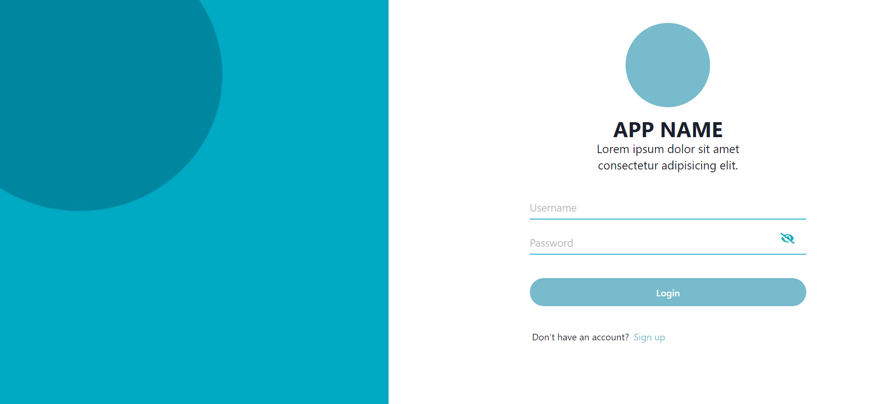

### Signup Page with form validation
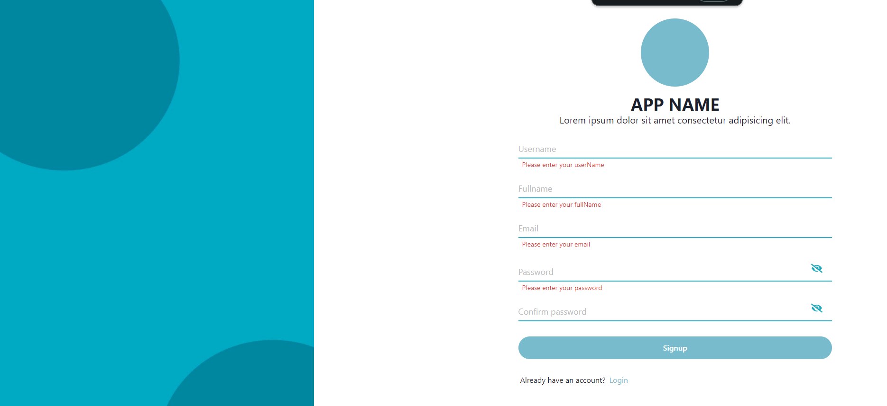
### Homepage Page
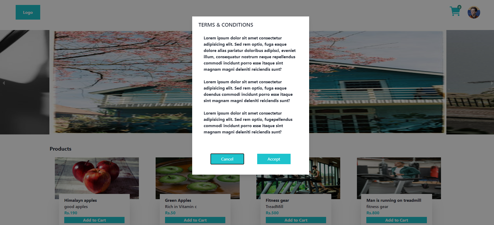
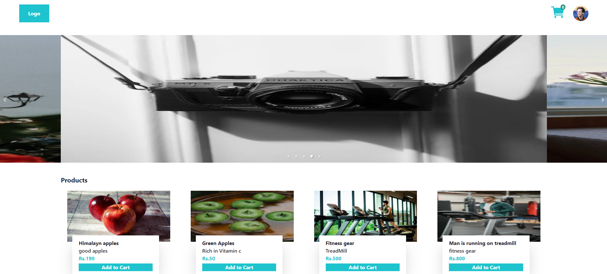
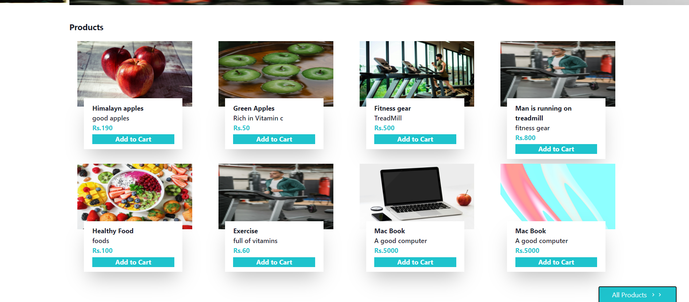
- Add to Cart
  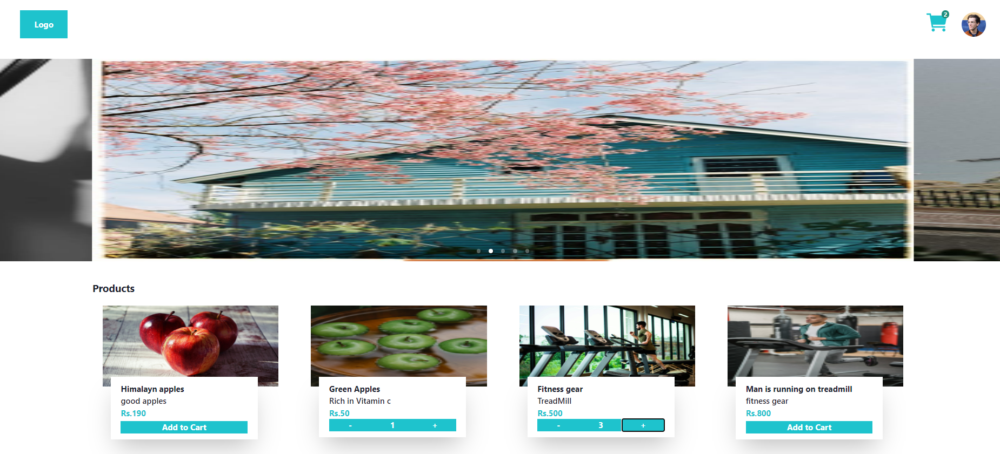

### Cart Page
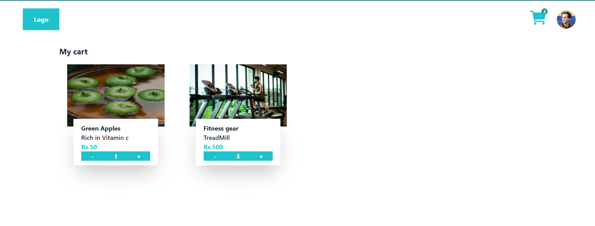
  - Profile Menu
  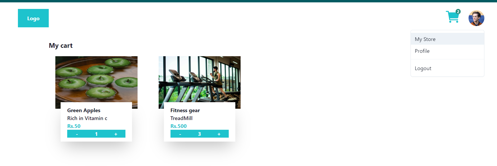
### All Products Page
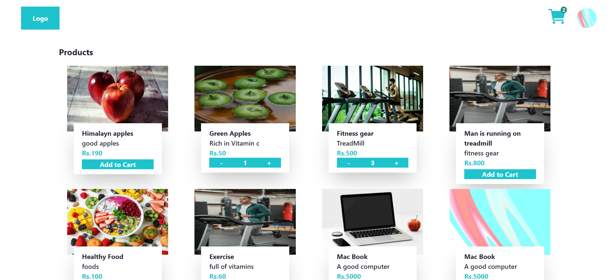
### My Store Page
 - Category Section
 -  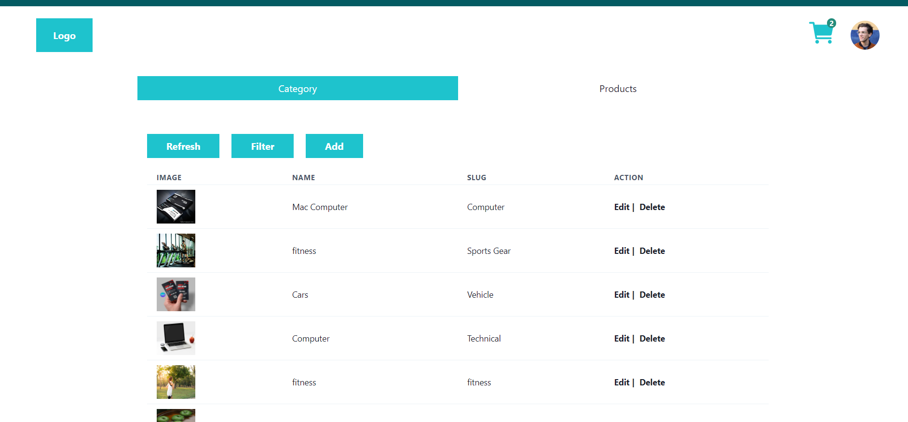  
    -  Filter
      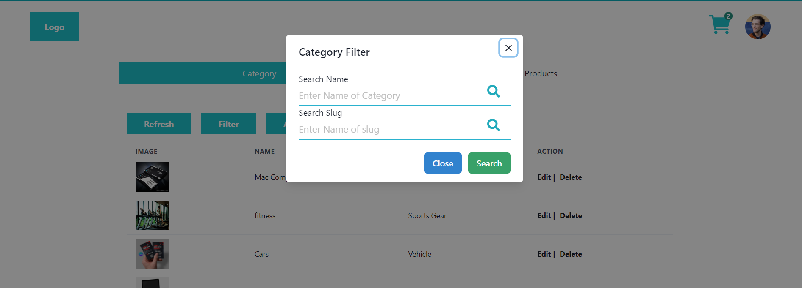
    - Add Category
     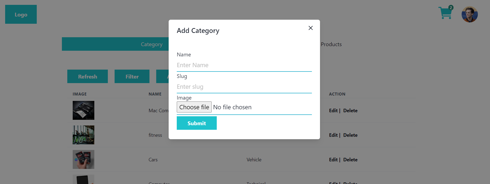
  - Products Section   
   - 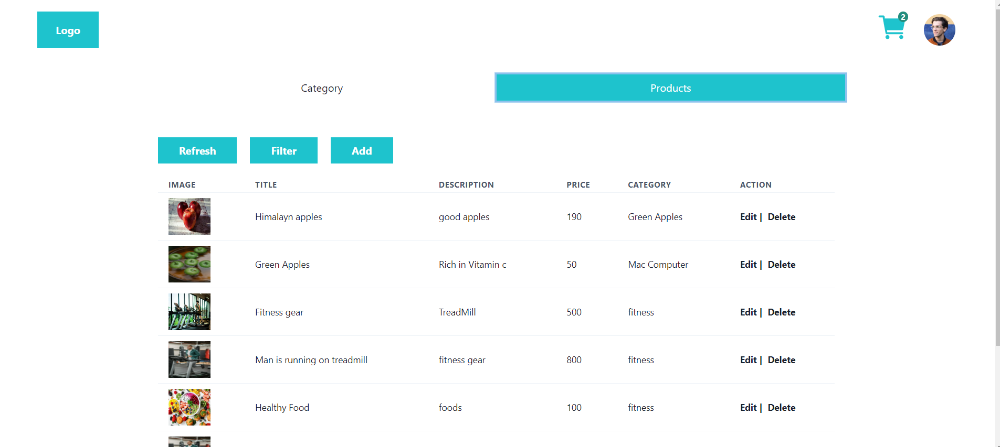
     - Filter
         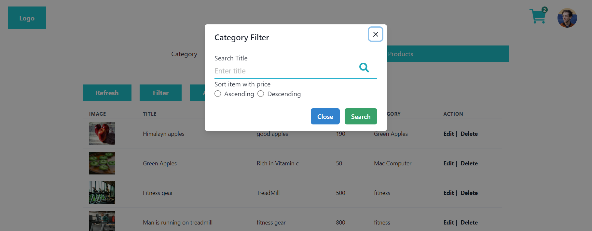

- Add Product   
        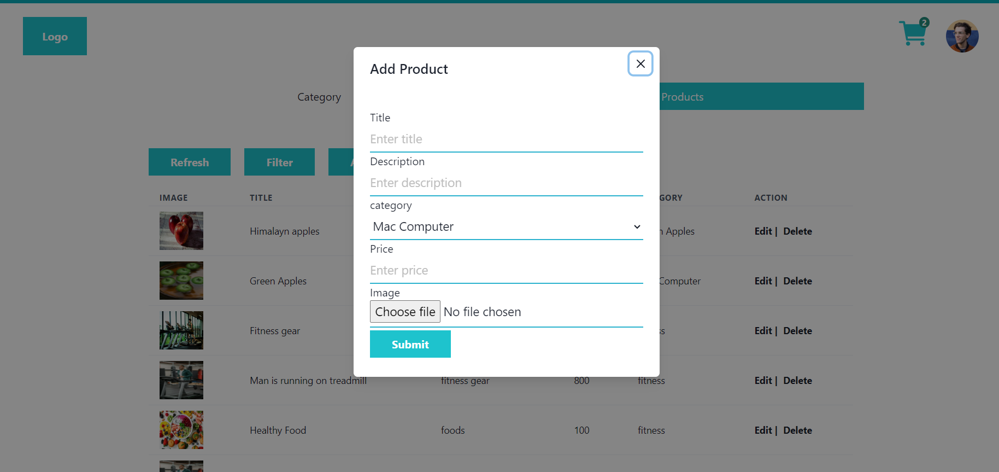

### Profile Page
 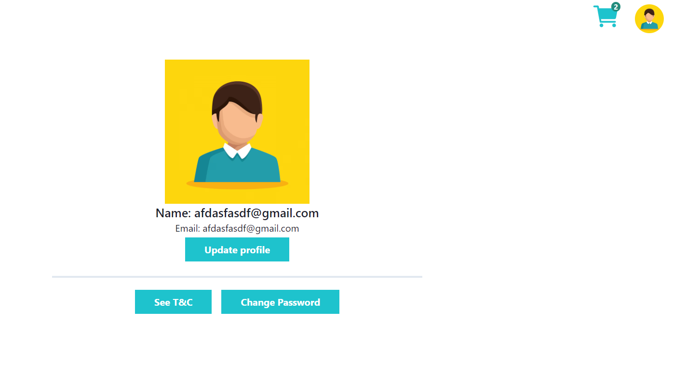
 - Can Update the Name
   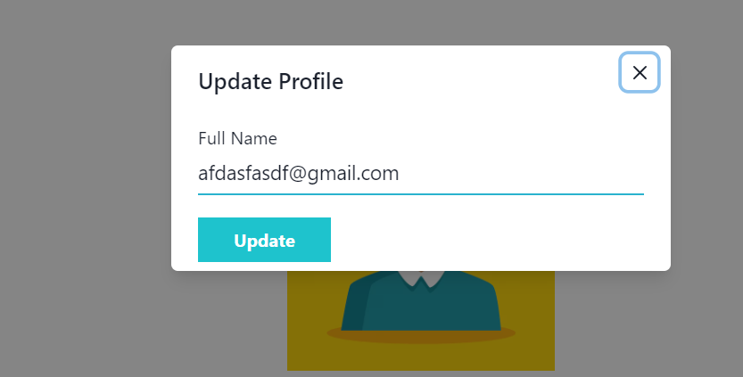
 -  Can Update the Password
   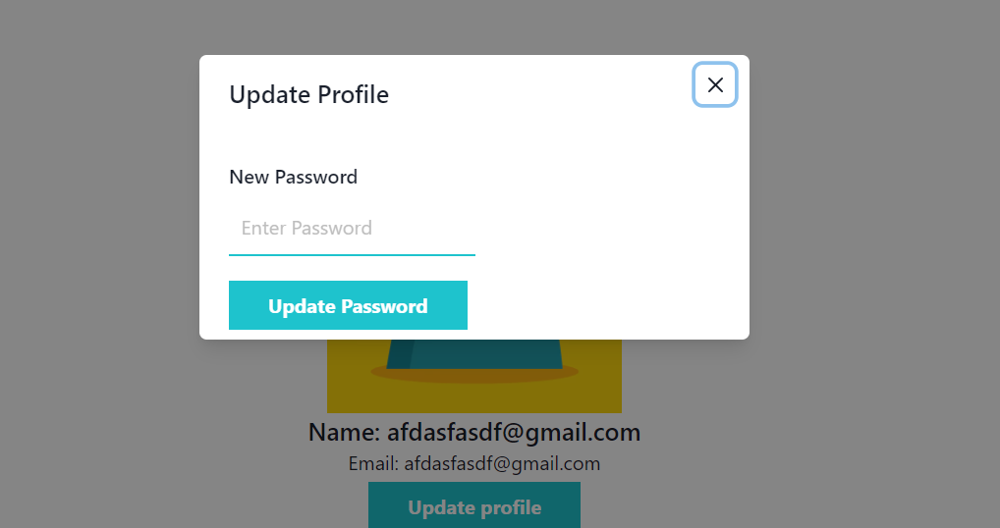 
-  Can Upload Image
   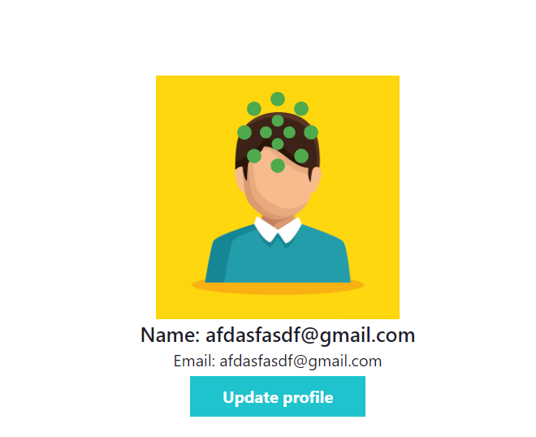
# Thank you for your time

- Thank you for using this application
- Feel free to ask any query.

[My Github](https://github.com/tarun-upadhyay)
https://github.com/tarun-upadhyay

[My Portfolio](https://tarun-upadhyay.github.io/)
https://tarun-upadhyay.github.io/

[Email ME](mailto:tarunu88@gmail.com)

---
